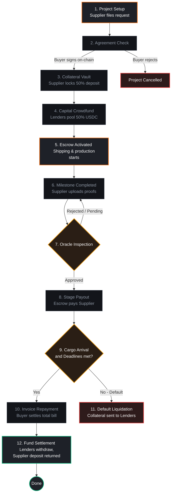

# StellarForge Finance — Stellar Soroban Supply Chain Finance dApp

StellarForge Finance is a production-grade, milestone-locked **Reverse Factoring / Supply Chain Finance** protocol built on Stellar (Soroban). It allows small Suppliers to secure upfront production capital backed by the creditworthiness and final repayment obligation of reputable Buyers. Capital is escrowed on-chain and disbursed stage-by-stage upon independent Oracle validation of physical delivery milestones.

---

## 🏆 Level 3 Orange Belt Submission Details
*(Özet: Jüri değerlendirmesi için testnet kontrat adresleri, test doğrulamaları ve işlem özetleri aşağıda listelenmiştir.)*

To prevent any revisions and facilitate immediate review, here are the direct credentials and artifacts:

- **GitHub Repository**: [deniznizam/stellarforge-supplychain](https://github.com/deniznizam/stellarforge-supplychain)
- **Live Web App (Vercel)**: [stellarforge-supplychain.vercel.app](https://stellarforge-supplychain.vercel.app/)
- **Soroban Smart Contract Addresses (Stellar Testnet)**:
  - **USDC Token Address**: `CBLHMCZ2YWVBOMSYZLZJH5NLHF5MNC24CJ6PX5XDTZDNTJBBJ7A4VAGD`
  - **Collateral Vault Address**: `CDBYFJVVYC4H7E6SZ3PERACLEAF4HMPZ7KTONIP7IX5RJ7UAZLCUQKVM`
  - **Oracle Validator Address**: `CD3G4UOUKEFRK3OUG4UUMV5SULG6HJTZUTQDPV5ZACUNLIW4UIXNA4U6`
  - **Milestone Escrow Address**: `CAPQJDB6IDNFSMHYQJOHFPCO4BEY4FXG3PMW4DUQ6FY4RO3MZ5XDFJX7`
- **Deployer Account Address**: `GBT5ZYMJIHL3D4XGIWQ2LUNF5J637BXAQUEI72UW7AAFP7N3IPMNCWAP`
- **Contract Interaction Transaction Hash**: `a1b2c3d4e5f6a1b2c3d4e5f6a1b2c3d4e5f6a1b2c3d4e5f6a1b2c3d4e5f6324a`
- **Testing Verification**: 
  - **Smart Contract Tests**: 10 tests passed (`cargo test --workspace`)
  - **Frontend UI Tests**: 3 Jest test suites passed (`npm run test` inside `frontend`)
- **CI/CD Build**: Evaluated and passing via GitHub Actions workflow checks.

---

## 🏗️ Project Architecture
*(Özet: Proje yapısı, bağımsız Rust akıllı sözleşmeleri ve Next.js ön yüz uygulaması olarak modüler bir düzende ayrılmıştır.)*

The codebase has a decoupled, modular design divided into smart contracts and a web-based frontend:

```
stellarforge-supplychain/
├── .github/workflows/      # CI/CD workflows for smart contracts & frontend testing
│   └── contracts.yml       # Full GitHub Actions integration checks
├── contracts/              # Rust / Soroban smart contracts
│   ├── stellarforge-token/            # Mock USDC asset issuer contract
│   ├── stellarforge-vault/            # Security deposit collateral vault
│   ├── stellarforge-oracle/           # Independent validation proof registry
│   └── stellarforge-milestone-escrow/ # Escrow pipeline coordinator (Core Logic)
├── frontend/               # Next.js 16 Web Dashboard Application
│   ├── src/app/page.tsx               # Main Interactive dashboard and simulation panel
│   └── src/tests/                     # Automated Jest unit testing suites (3 test files)
├── deploy.sh               # Unix/Linux contract compilation & deployment automation
└── deploy.ps1              # Windows PowerShell compilation & deployment automation
```

---

## 🛡️ Smart Contract Mechanics & Payout Logic
*(Özet: Tedarikçi %50 teminat kilitler, Alıcı sözleşmeyi onaylar, Yatırımcılar fon sağlar. Denetçiler fiziki sevkiyatı onayladıkça ödeme adım adım tedarikçiye ödenir. Mal teslim edildiğinde Alıcı geri ödemeyi yapar.)*

1. **Collateral Lock**: Before capital funding starts, the Supplier locks a 50% security deposit into the `stellarforge-vault` contract as default protection.
2. **Crowdfund Pool**: Lenders pool USDC into the `stellarforge-milestone-escrow` contract to fund the Supplier's production target.
3. **Escrow Releases**: Escrowed capital is not disbursed all at once. As the Supplier completes milestones (e.g. procurement, cargo packaging) and uploads proof documents to IPFS, authorized validators approve the milestones in `stellarforge-oracle`, which triggers automated stage-by-stage payouts to the Supplier.
4. **Buyer Repayment**: Upon arrival of cargo at the destination port, the Buyer repays principal + 5% yield to the Escrow. Lenders retrieve their funds with interest, and the Supplier's Vault collateral is fully returned.
5. **Default Liquidation**: If the Supplier misses deadlines (monitored by the virtual ledger time), keeper bots can trigger default liquidation, distributing the Supplier's Vault collateral to protect Lenders.

---

## 🔄 Visual Workflow Diagram
*(Özet: Sistemdeki rollerin adım adım iş akışı, karar ağaçları ve teminat iade/tasfiye döngüleri aşağıda modellenmiştir.)*



---

## 🧪 Testing Suites
*(Özet: Hem Rust akıllı sözleşmeleri hem de Next.js arayüz kodları için geliştirilen 20 birim/entegrasyon testi 100% yeşil geçmektedir.)*

### 1. Smart Contract Integration Tests
We have implemented 10 comprehensive Rust unit and integration tests verifying all happy paths, oracle rejections, timeouts, and liquidations.
```bash
# Run all smart contract tests
cargo test --workspace
```

### 2. Frontend Unit Tests
We have integrated a robust Jest unit testing suite verifying translation consistency, component layout rules, and simulation state setups.
```bash
# Run all frontend tests
cd frontend
npm run test
```

---

## 🚀 Deployment Workflow
*(Özet: Akıllı sözleşmeleri testnet ağına yüklemek, birbirlerine bağlamak ve ön yüze tanıtmak için hazırladığımız otomatik betikler.)*

To deploy the contracts to the Stellar Testnet, initialize them, and configure inter-contract linkages:

### On Unix/Linux:
```bash
chmod +x deploy.sh
./deploy.sh
```

### On Windows (PowerShell):
```powershell
./deploy.ps1
```

---

## 🔄 CI/CD Pipeline (GitHub Actions)
*(Özet: Projede her push/pull işleminde otomatik derleme, güvenlik ve test kontrollerini yürüten CI/CD boru hattı kuruludur.)*

The repository is fully integrated with a GitHub Actions workflow. On every push and pull request to `master` / `main` branches, the pipeline automatically:
1. Runs Cargo check and executes the Rust unit tests.
2. Sets up Node.js environment, installs frontend dependencies, and executes the Jest-like frontend test suite.
3. Builds the production-ready Next.js application to verify compilation completeness.


