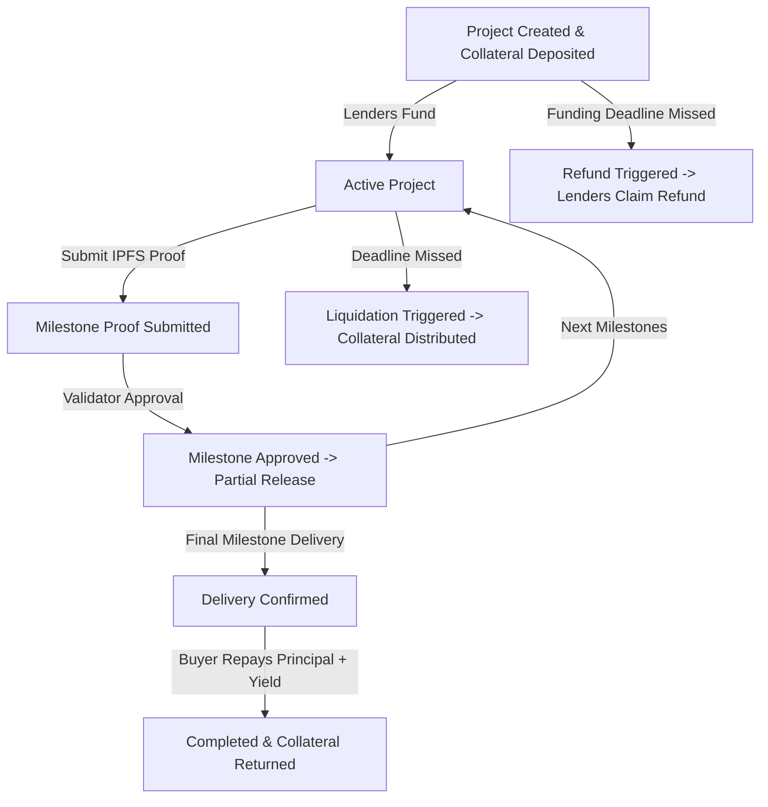

# StellarForge: Supply Chain Finance + Milestone Crowdfunding Hybrid

StellarForge is an end-to-end decentralized application (dApp) built on Stellar (Soroban) that allows suppliers to secure funding for supply chain projects, with funds released incrementally as milestones are verified. The platform integrates a buyer-backed repayment model (reverse factoring) and collateral vaults with automated liquidation to protect investor capital.

## High-Level Architecture

```
                       +---------------------------------------+
                       |              Frontend                 |
                       |       (Next.js + Tailwind CSS)        |
                       +-------------------+-------------------+
                                           | (Wallet Connect & Events)
                                           v
                       +-------------------+-------------------+
                       |        MilestoneEscrow Contract       |
                       |             (Core Logic)              |
                       +-------+-------------+-----------+-----+
                               |             |           |
        (Inter-contract calls) |             |           |
                               v             v           v
                     +---------+--+      +---+----+  +---+----+
                     |    Token   |      |  Vault |  | Oracle |
                     |  Contract  |      |Contract|  |Contract|
                     +------------+      +--------+  +--------+
```

The system is split into four primary modular contracts:
1. **Token Contract**: Standard Stellar Soroban Token interface (handling project currencies like USDC).
2. **Vault Contract**: Manages borrower collateral (lock, release, and liquidation).
3. **MilestoneEscrow Contract (Core/Orchestrator)**: Handles project lifecycle, crowdfund pooling, milestone releases, buyer repayment, and distributions.
4. **Oracle/Validator Contract**: Manages whitelist of validators; evaluates milestone proof hashes (1-of-N consensus for simplicity).

---

## 1. Concrete Application Scenario (Example)

To anchor the user experience and testing, we use the following concrete scenario throughout development, documentation, and the final demo:

* **Supplier/Borrower (Tedarikçi)**: "Acme Logistics" requests a **10,000 USDC** loan for manufacturing raw components.
* **Funding Target**: 10,000 USDC.
* **Collateral Required**: Acme deposits **5,000 USDC** (50% collateral ratio) into the `Vault` contract.
* **Yield (Faiz)**: 5% (500 USDC) paid by the buyer upon successful completion.
* **Milestones**:
  1. *Milestone 1 (Material Procurement)*: 3,000 USDC released to supplier. Deadline: T+10 days.
  2. *Milestone 2 (Component Assembly)*: 4,000 USDC released to supplier. Deadline: T+20 days.
  3. *Milestone 3 (Final Quality Assurance & Delivery)*: 3,000 USDC released to supplier. Deadline: T+30 days.
* **Repayment**: The Buyer ("MegaCorp") verifies Milestone 3, takes delivery, and deposits **10,500 USDC** (10,000 principal + 500 yield) into the escrow.
* **Distribution**:
  - Investors (Lenders) receive their funded principal pro-rata + 500 USDC yield.
  - Acme Logistics receives their 5,000 USDC collateral back from the `Vault`.

---

## 2. Smart Contract Details (Soroban Rust)

### 2.1 Soroban-Specific Architectural Advantages
StellarForge is designed specifically around the Soroban architecture:
- **Built-in Authorization Framework**: We utilize `address.require_auth()` for cryptographic validation instead of custom signature verification schemes, reducing gas usage and vulnerability windows.
- **State Rent & TTL Model**: Project storage keys (`Project` and `Milestone`) utilize Soroban's `Persistent` storage type, while temporary validator claims and voting status keys use `Temporary` storage to minimize storage fee footprints and prevent state-bloat rent penalties.
- **Stellar Asset Contract (SAC) Integration**: All asset interactions directly align with Stellar's official token interface, allowing seamless interoperability with native XLM or anchored assets (USDC, EURC) without requiring custom wrapping contracts.

### 2.2 Data Structures & Enums
```rust
#[contracttype]
#[derive(Clone, Debug, Eq, PartialEq)]
pub struct Milestone {
    pub id: u32,
    pub description: String,
    pub deadline: u64,
    pub amount_to_release: i128,
    pub proof_hash: String,           // IPFS CID containing evidence
    pub status: MilestoneStatus,
}

#[contracttype]
#[derive(Clone, Debug, Eq, PartialEq)]
pub struct Project {
    pub id: u64,
    pub borrower: Address,
    pub buyer: Option<Address>,       // Optional buyer address
    pub token: Address,               // Token contract address (USDC/XLM)
    pub target_amount: i128,          // Total funding requested
    pub funded_amount: i128,          // Total pooled from lenders
    pub funding_deadline: u64,        // Deadline to meet funding target
    pub milestones: Vec<Milestone>,   // Project milestones
    pub status: ProjectStatus,
    pub created_at: u64,
}

#[contracttype]
#[derive(Clone, Copy, Debug, Eq, PartialEq)]
pub enum ProjectStatus {
    Pending,
    Active,
    Completed,
    Liquidated,
    Defaulted,
}

#[contracttype]
#[derive(Clone, Copy, Debug, Eq, PartialEq)]
pub enum MilestoneStatus {
    Pending,
    ProofSubmitted,
    Approved,
    Rejected,
}
```

### 2.3 Contract Interfaces

#### 2.3.1 MilestoneEscrow Contract
* `initialize(env: &Env, admin: Address, vault: Address, oracle: Address, token: Address)`
* `create_project(env: &Env, borrower: Address, buyer: Option<Address>, target_amount: i128, funding_deadline: u64, milestones: Vec<Milestone>) -> u64`
* `fund_project(env: &Env, lender: Address, project_id: u64, amount: i128)`
* `claim_refund(env: &Env, lender: Address, project_id: u64)` -> *Lenders clawback funds if funding target is missed by deadline*
* `submit_milestone_proof(env: &Env, project_id: u64, milestone_id: u32, proof_hash: String)`
* `approve_milestone(env: &Env, project_id: u64, milestone_id: u32)` -> *Called by Whitelisted Validator*
* `buyer_confirm_and_repay(env: &Env, project_id: u64, repayment_amount: i128)`
* `trigger_liquidation(env: &Env, project_id: u64)`

#### 2.3.2 Vault Contract
* `initialize(env: &Env, escrow: Address)`
* `deposit_collateral(env: &Env, borrower: Address, token: Address, amount: i128)`
* `lock_collateral(env: &Env, borrower: Address, amount: i128)`
* `release_collateral(env: &Env, borrower: Address, recipient: Address, amount: i128)`
* `liquidate_collateral(env: &Env, borrower: Address, recipient: Address) -> i128`
* `get_collateral_amount(env: &Env, borrower: Address) -> i128`

#### 2.3.3 Oracle/Validator Contract
* `initialize(env: &Env, admin: Address)`
* `add_validator(env: &Env, validator: Address)`
* `remove_validator(env: &Env, validator: Address)`
* `is_validator(env: &Env, validator: Address) -> bool`
* `validate_proof(env: &Env, project_id: u64, milestone_id: u32, proof_hash: String) -> bool`

---

## 3. Operation Flows & Logic

### 3.1 Project Lifecycle


1. **Collateralization & Creation**: The borrower deposits stable collateral to Vault (`Vault.deposit_collateral`). Then, `MilestoneEscrow.create_project` is called, verifying the locked amount is at least 50% (adjustable ratio) of the project target.
2. **Crowdfunding**: Lenders call `MilestoneEscrow.fund_project`. Funds are held in Escrow. Once `target_amount` is met, project status updates to `Active`.
3. **Execution & Submission**: Borrower uploads documentation to IPFS and calls `submit_milestone_proof(..., proof_hash)`.
4. **Verification & Release**:
   - Validation is simplified to a **1-of-N Whitelisted Validator** model. Any address registered on the Oracle contract can call `approve_milestone`.
   - On approval, the Milestone's specific allocation is sent to the borrower.
5. **Buyer Repayment (Reverse Factoring)**: Upon final delivery, the Buyer calls `buyer_confirm_and_repay` transferring `target_amount + interest` back to the Escrow.
   - Escrow returns collateral to the borrower via the Vault.
   - Escrow distributes principal + yield (pro-rata) to lenders.
6. **Default & Liquidation**: Liquidation is **strictly time-bound**. If the current ledger timestamp exceeds the milestone deadline and status is not approved:
   - Anyone can call `trigger_liquidation`.
   - A fixed liquidator bonus (5% of collateral) is sent to the trigger address.
   - The remaining collateral is claimed from the Vault and distributed along with any unreleased escrow funds to lenders pro-rata.

---

## 4. Soroban Event Streaming

To enable real-time UI updates, the contracts will emit structured events using `env.events().publish()`:

| Event Name | Topics | Data Payload | Emitted By |
| :--- | :--- | :--- | :--- |
| **ProjectCreated** | `("proj_created", project_id: u64)` | `(borrower: Address, target_amount: i128, token: Address)` | `MilestoneEscrow` |
| **ProjectActive** | `("proj_active", project_id: u64)` | `()` | `MilestoneEscrow` |
| **ProofSubmitted** | `("proof_submitted", project_id: u64, milestone_id: u32)` | `(proof_hash: String)` | `MilestoneEscrow` |
| **MilestoneApproved** | `("milestone_approved", project_id: u64, milestone_id: u32)` | `(amount_released: i128)` | `MilestoneEscrow` |
| **RepaymentReceived** | `("repaid", project_id: u64)` | `(repayment_amount: i128, buyer: Address)` | `MilestoneEscrow` |
| **ProjectLiquidated** | `("liquidated", project_id: u64)` | `(collateral_claimed: i128, liquidator: Address)` | `MilestoneEscrow` |

---

## 5. Error Handling & Security

1. **Authorization**:
   - `borrower.require_auth()` ensures only the registered borrower can submit proofs.
   - Validator authorization checks against `Oracle.is_validator(validator)` during approval steps.
   - `buyer.require_auth()` ensures only the specified buyer can confirm and repay.
2. **Reentrancy**:
   - All state updates occur strictly before token transfer operations.
3. **Custom Errors**:
   - `NotAuthorized`: User is not authorized to execute this action.
   - `InvalidState`: Project state does not permit the requested transaction.
   - `DeadlineNotPassed`: Attempted liquidation before deadline expiry.
   - `InsufficientCollateral`: Collateral in Vault is less than the required minimum.
   - `InsufficientFunds`: User has insufficient balance to participate.
   - `MilestoneNotFound`: Requested milestone ID does not exist in the project.
   - `ProjectNotActive`: Target project is not in Active state.
   - `OracleValidationFailed`: Proof validation failed.

---

## 6. Verification & Testing Plan

### 6.1 Smart Contract Tests (Soroban Rust Test Framework)
1. **Happy Path Integration Test**: Verifies creation, funding, 3 milestones approval, and buyer repayment with interest split.
2. **Insufficient Collateral Test**: Fails project creation when collateral deposited is below LTV threshold.
3. **Liquidation & Reward Test**: Triggers liquidation after deadline breach, verifying liquidator bonus and pro-rata lender distribution.
4. **Auth Violation Test**: Ensures only borrower can submit proof, only validator can approve milestones, and only buyer can repay.
5. **Project Expiry Refund Test**: Ensures lenders get refunded via `claim_refund` if funding target isn't met by deadline.
6. **Partial Milestone Release & Pro-rata Distribution**: Verifies multiple lenders receive accurate fractions of yield.
7. **Oracle Validation Failure**: Ensures incorrect proof hashes result in validation rejection.

### 6.2 Frontend Tests (Jest + RTL)
1. **Dashboard Rendering**: Verify project list, milestones tracker, and values display.
2. **Wallet Connection State**: Verify UI changes upon Freighter connection.
3. **Loading & Toast Notification States**: Verify spinner and transaction feedback (Success/Error).
4. **Real-time Event Listening Mock**: Mock `MilestoneApproved` event and check dynamic UI status updates.
5. **Transaction Status Tracking Mock**: Mock transition from pending to success/failed and verify button/loader states.

---

## 7. Frontend User Experience Guidelines

To ensure maximum accessibility, the user interface will reject complex cryptographic jargon in favor of clear business-oriented supply chain terminology:

* **Avoid**: "Invoke MilestoneEscrow trigger_liquidation method", "Address signature authorization required", "LTV vault factor".
* **Use**: "Liquidate Defaulted Project", "Confirm Wallet Signature", "Collateral Ratio".
* **Visual Presentation**: Use clean color-coded status pills (e.g., Green for "Repaid/Completed", Yellow for "Awaiting Proof", Red for "Defaulted"). Interactive milestones should utilize simple step-by-step wizard trackers.

---

## 8. CI/CD & Deployment Workflow

- **CI Pipeline (`contracts.yml`)**: Run formatter, check clippy linting, run 7 integration test suites, compile contract WASMs, and deploy contracts to Futurenet.
- **Frontend Pipeline (`frontend.yml`)**: Run Node tests, compile frontend build, and deploy to Vercel/Netlify.
- **Initialization Script (`scripts/deploy.js`)**: Automates sequential contract deployment and linking of Vault, Oracle, and Escrow addresses.

---

## 9. Scope & MVP Pragmatism (Out of Scope for Orange Belt)
To manage implementation risk within the timeline, the following features are explicitly out of scope:
- On-chain lender voting for milestone approval (simplified to whitelisted validator approval).
- Dynamic price feeds / Volatile asset Oracle (collateral is assumed to be stable USDC/XLM, liquidation is purely time-bound).
- Multi-signature / M-of-N validator consensus (simplified to 1-of-N whitelist validation).
