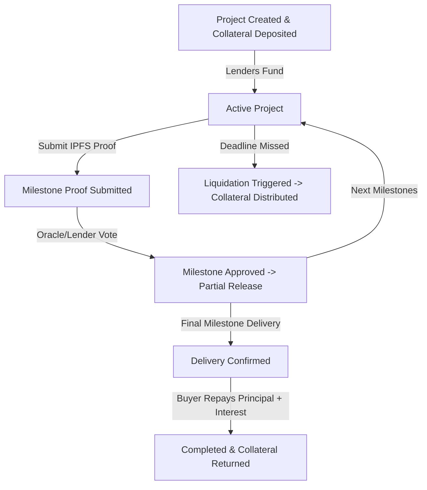

# StellarForge: Supply Chain Finance + Milestone Crowdfunding Hybrid

StellarForge is an end-to-end decentralized application (dApp) built on Stellar (Soroban) that allows suppliers to secure funding for supply chain projects, with funds released incrementally as milestones are verified. The platform integrates a buyer-backed repayment model (reverse factoring) and collateral vaults with automated liquidation to protect investor capital.

## High-Level Architecture

```
                       +---------------------------------------+
                       |              Frontend                 |
                       |       (Next.js + Tailwind CSS)        |
                       +-------------------+-------------------+
                                           | (Wallet Connect & Events)
                                           v
                       +-------------------+-------------------+
                       |        MilestoneEscrow Contract       |
                       |             (Core Logic)              |
                       +-------+-------------+-----------+-----+
                               |             |           |
        (Inter-contract calls) |             |           |
                               v             v           v
                     +---------+--+      +---+----+  +---+----+
                     |    Token   |      |  Vault |  | Oracle |
                     |  Contract  |      |Contract|  |Contract|
                     +------------+      +--------+  +--------+
```

The system is split into four primary modular contracts:
1. **Token Contract**: Standard Stellar Soroban Token interface (handling project currencies like USDC).
2. **Vault Contract**: Manages borrower collateral, locks/unlocks collateral, and performs liquidations.
3. **MilestoneEscrow Contract (Core/Orchestrator)**: Handles project lifecycle (creation, funding, milestone progress, buyer repayment, and pro-rata distributions).
4. **Oracle/Validator Contract**: Multi-validator registry that evaluates milestone delivery proofs.

---

## 1. Smart Contract Details (Soroban Rust)

### 1.1 Data Structures & Enums
```rust
#[contracttype]
#[derive(Clone, Debug, Eq, PartialEq)]
pub struct Milestone {
    pub id: u32,
    pub description: String,
    pub deadline: u64,
    pub amount_to_release: i128,
    pub proof_hash: String,           // IPFS CID/Hash containing evidence
    pub status: MilestoneStatus,
}

#[contracttype]
#[derive(Clone, Debug, Eq, PartialEq)]
pub struct Project {
    pub id: u64,
    pub borrower: Address,
    pub buyer: Option<Address>,       // Optional buyer address
    pub token: Address,               // Token contract address (USDC/XLM)
    pub target_amount: i128,          // Total funding requested
    pub funded_amount: i128,          // Total pooled from lenders
    pub milestones: Vec<Milestone>,   // Project milestones
    pub status: ProjectStatus,
    pub created_at: u64,
}

#[contracttype]
#[derive(Clone, Copy, Debug, Eq, PartialEq)]
pub enum ProjectStatus {
    Pending,
    Active,
    Completed,
    Liquidated,
    Defaulted,
}

#[contracttype]
#[derive(Clone, Copy, Debug, Eq, PartialEq)]
pub enum MilestoneStatus {
    Pending,
    ProofSubmitted,
    Approved,
    Rejected,
}
```

### 1.2 Contract Interfaces

#### 1.2.1 MilestoneEscrow Contract
* `initialize(env: &Env, admin: Address, vault: Address, oracle: Address, token: Address)`
* `create_project(env: &Env, borrower: Address, buyer: Option<Address>, target_amount: i128, milestones: Vec<Milestone>) -> u64`
* `fund_project(env: &Env, project_id: u64, amount: i128)`
* `submit_milestone_proof(env: &Env, project_id: u64, milestone_id: u32, proof_hash: String)`
* `approve_milestone(env: &Env, project_id: u64, milestone_id: u32)`
* `buyer_confirm_and_repay(env: &Env, project_id: u64, repayment_amount: i128)`
* `trigger_liquidation(env: &Env, project_id: u64)`

#### 1.2.2 Vault Contract
* `initialize(env: &Env, escrow: Address)`
* `deposit_collateral(env: &Env, borrower: Address, token: Address, amount: i128)`
* `lock_collateral(env: &Env, borrower: Address, amount: i128)`
* `release_collateral(env: &Env, borrower: Address, recipient: Address, amount: i128)`
* `liquidate_collateral(env: &Env, borrower: Address, recipient: Address) -> i128`
* `get_collateral_amount(env: &Env, borrower: Address) -> i128`
* `get_health_factor(env: &Env, project_id: u64) -> i128`

#### 1.2.3 Oracle/Validator Contract
* `initialize(env: &Env, admin: Address)`
* `add_validator(env: &Env, validator: Address)`
* `remove_validator(env: &Env, validator: Address)`
* `validate_proof(env: &Env, project_id: u64, milestone_id: u32, proof_hash: String) -> bool`

---

## 2. Operation Flows & Logic

### 2.1 Project Lifecycle


1. **Collateralization & Creation**: The borrower calls `Vault.deposit_collateral` to lock 120-150% LTV equivalent of tokens. Then, calls `MilestoneEscrow.create_project`, which checks the vault balance.
2. **Crowdfunding**: Investors call `MilestoneEscrow.fund_project`. The funds are escrowed in the escrow contract. Once `target_amount` is reached, state changes to `Active`.
3. **Execution**: The borrower uploads proof to IPFS and calls `submit_milestone_proof(..., proof_hash)`.
4. **Verification & Partial Release**:
   - For minor milestones: The validator triggers `approve_milestone` (calls `Oracle.validate_proof`).
   - For major milestones: A pro-rata vote of lenders is conducted on-chain (or simulated via validator logic).
   - Once approved, `Escrow` sends the specific milestone's allocation to the borrower (`Token.transfer`).
5. **Buyer Repayment (Reverse Factoring)**: Upon final delivery, the Buyer calls `buyer_confirm_and_repay` transferring `target_amount + interest` back to the Escrow contract. The escrow distributes:
   - To lenders: Principal + Yield (pro-rata).
   - To borrower: Leftover profit and releases Vault collateral.
6. **Default & Liquidation**: If current timestamp exceeds milestone deadline and status is not approved:
   - Anyone can call `trigger_liquidation`.
   - 5-10% of the collateral goes to the liquidator address as a keeper reward.
   - Remaining collateral and remaining escrowed project funds are returned to lenders pro-rata.

---

## 3. Error Handling & Security

1. **Authorization**:
   - Standard `require_auth()` is used on all sensitive user functions.
   - Restrictive checks ensure `submit_milestone_proof` can only be initiated by the project borrower.
   - `buyer_confirm_and_repay` requires the buyer's authorization.
2. **Reentrancy**:
   - State updates occur strictly before token transfer operations.
3. **Custom Errors**:
   - `NotAuthorized`: User is not authorized to execute this action.
   - `InvalidState`: Project state does not permit the requested transaction.
   - `DeadlineNotPassed`: Attempted liquidation before deadline expiry.
   - `InsufficientCollateral`: Collateral in Vault is less than the required minimum.
   - `InsufficientFunds`: User has insufficient balance to participate.
   - `MilestoneNotFound`: Requested milestone ID does not exist in the project.
   - `ProjectNotActive`: Target project is not in Active state.
   - `OracleValidationFailed`: Proof validation failed.

---

## 4. Verification & Testing Plan

### 4.1 Smart Contract Tests (Soroban Rust Test Framework)
1. **Happy Path Integration Test**: Verifies creation, funding, 3 milestones approval, and buyer repayment with interest split.
2. **Insufficient Collateral Test**: Fails project creation when collateral deposited is below LTV threshold.
3. **Liquidation & Reward Test**: Triggers liquidation after deadline breach, verifying liquidator bonus and pro-rata lender distribution.
4. **Auth Violation Test**: Ensures only borrower can submit proof, only validator can approve milestones, and only buyer can repay.
5. **Project Expiry Refund Test**: Ensures lenders get refunded if funding target isn't met by deadline.
6. **Partial Milestone Release & Pro-rata Distribution**: Verifies multiple lenders receive accurate fractions of yield.
7. **Oracle Validation Failure**: Ensures incorrect proof hashes result in `OracleValidationFailed`.

### 4.2 Frontend Tests (Jest + RTL)
1. **Dashboard Rendering**: Verify project list, milestones tracker, and values display.
2. **Wallet Connection State**: Verify UI changes upon Freighter connection.
3. **Loading & Toast Notification States**: Verify spinner and transaction feedback (Success/Error).
4. **Real-time Event Listening Mock**: Mock `MilestoneApproved` event and check dynamic UI status updates.
5. **Transaction Status Tracking Mock**: Mock transition from pending to success/failed and verify button/loader states.

---

## 5. CI/CD & Deployment Workflow

- **CI Pipeline (`contracts.yml`)**: Run formatter, check clippy linting, run 7 integration tests, compile contract WASMs, and deploy contracts to Futurenet.
- **Frontend Pipeline (`frontend.yml`)**: Run Node tests, compile frontend build, and deploy to Vercel/Netlify.
- **Initialization Script (`scripts/deploy.js`)**: Automates sequential contract deployment and linking of Vault, Oracle, and Escrow addresses.
