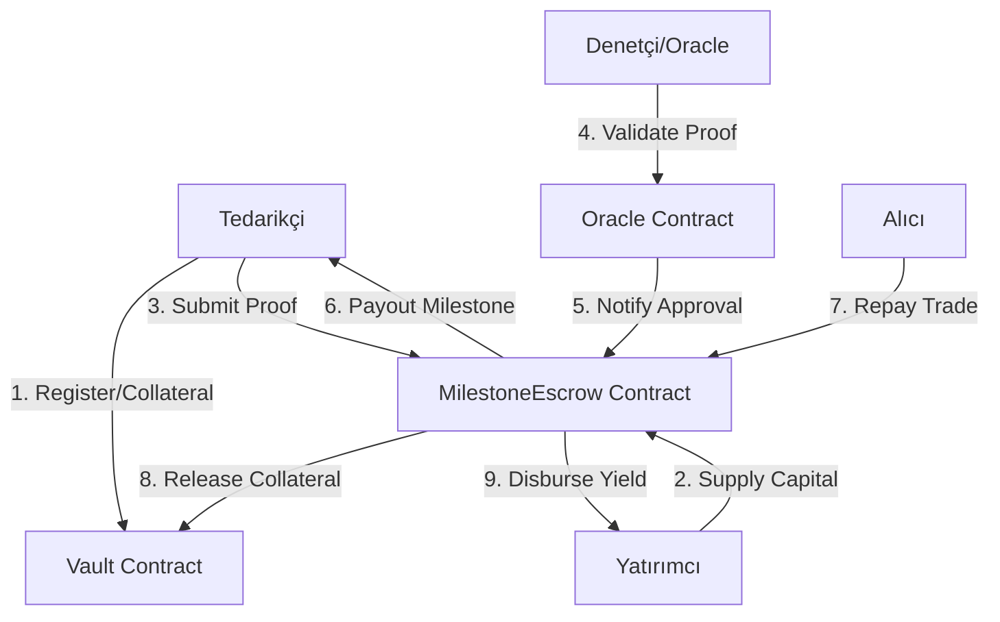

# StellarForge Finance: Technical Specification & Architecture

StellarForge Finance is a decentralized, milestone-backed **Supply Chain Finance (SCF) / Reverse Factoring** protocol built on the Stellar Soroban smart contract framework. It bridges industrial engineering logistics flows with decentralized finance (DeFi) liquidity pools, allowing suppliers to finance their production cycles secure in the knowledge that reputable buyers will repay the capital upon final delivery, while protecting lenders with programmatic vault collateral and oracle validation.

---

## 1. Mimarinin Amacı (Core Business Logic)

Geleneksel ticarette küçük tedarikçiler (Suppliers), büyük alıcılardan (Buyers) aldıkları siparişleri üretmek için yüksek sermaye ihtiyacı duyarlar. Alıcılar genellikle vadeli ödeme (örn. 90 gün sonra) talep eder.
StellarForge bu problemi şu şekilde çözer:
1. **Güvence (Collateral)**: Tedarikçi, bütçe hedefinin belirli bir oranını (%50) teminat olarak kasaya kilitler.
2. **Kitle Fonlaması (Crowdfunding)**: Yatırımcılar (Lenders), büyük ve güvenilir alıcının en sonunda ödeyeceğine güvenerek tedarikçinin üretim bütçesini fonlar.
3. **Parçalı Ödeme (Milestones)**: Fonlar tedarikçiye tek seferde verilmez. Üretim veya sevkiyat aşamaları tamamlanıp denetçi (Oracle) tarafından onaylandıkça serbest bırakılır. Bu sayede risk kontrol altında tutulur.
4. **Alıcı Geri Ödemesi (Settlement)**: Ürünler teslim edildiğinde alıcı anapara + %5 faizi geri öder. Tedarikçinin teminatı serbest kalır.
5. **Temerrüt Tasfiyesi (Liquidation)**: Tedarikçi süre sınırlarını aşar ve teslimat kanıtı sunamazsa, kilitli teminat tasfiye edilir ve yatırımcılara payları oranında dağıtılarak risk minimize edilir.

---

## 2. Akıllı Sözleşme Mimarisi (4-Contract Modular Layout)

Sistem, güvenlik sınırlarını ve sorumlulukları net bir şekilde ayırmak için 4 modüler sözleşmeden oluşur:



### A. Token Sözleşmesi (`contracts/token`)
* Stellar'ın standart SPL benzeri token arayüzünü uygular.
* USDC benzeri stabil coin simülasyonu sağlar.
* `transfer`, `mint`, `burn`, `approve` ve `balance` fonksiyonlarını sunar.

### B. Vault Sözleşmesi (`contracts/vault`)
* Tedarikçi teminatlarının (collateral) kilitlendiği, saklandığı ve tasfiye edildiği güvenli depodur.
* `deposit_collateral`, `release_collateral` ve `liquidate_collateral` yeteneklerine sahiptir.
* Sadece yetkilendirilmiş `MilestoneEscrow` sözleşmesi tarafından çağrılabilir.

### C. Oracle Sözleşmesi (`contracts/oracle`)
* Dış dünyadaki lojistik ve sevkiyat verilerinin (örn. IPFS sevkiyat evrakı hash'i) doğrulanmasından sorumludur.
* Yetkili denetçi adreslerinin listesini (whitelist) tutar.
* `validate_proof(proof_hash: Bytes)` çağrısıyla teslimat doğruluğunu onaylar veya reddeder.

### D. MilestoneEscrow (Orkestratör) Sözleşmesi (`contracts/milestone_escrow`)
* Projelerin oluşturulduğu, fonların toplandığı, milestone durumlarının yönetildiği ana merkezdir.
* **Depolama Stratejisi (Storage Strategy)**:
  * Proje verileri ve aktif durumlar `Persistent` storage üzerinde tutulur (proje geçmişinin silinmemesi için).
  * Geçici lojistik kanıtları ve sayaçlar `Temporary` storage ile saklanarak gas maliyetleri optimize edilir.
* **Event Yayınlama (Event Streaming)**:
  * Her kritik aşamada (Proje oluşturma, fonlama, kanıt sunumu, milestone onayı, geri ödeme ve tasfiye) zincir üstü event'ler fırlatır. Arayüz bu event'leri dinleyerek anlık güncellenir.

---

## 3. Akıllı Sözleşme Arayüzleri (Soroban Rust Interfaces)

### `MilestoneEscrow` Arayüzü:
```rust
pub trait MilestoneEscrowTrait {
    // Yeni bir tedarik zinciri projesi başlatır (Tedarikçi teminatı kilitler)
    fn create_project(
        env: Env,
        supplier: Address,
        buyer: Address,
        target_amount: i128,
        funding_deadline: u64,
        milestones: Vec<Milestone>,
        vault_wasm_hash: BytesN<32>,
        oracle_address: Address,
    ) -> u32;

    // Yatırımcılardan projeye USDC toplar
    fn fund_project(env: Env, lender: Address, project_id: u32, amount: i128);

    // Tedarikçi teslimat kanıtını (IPFS hash) zincire sunar
    fn submit_milestone_proof(env: Env, supplier: Address, project_id: u32, milestone_index: u32, proof_hash: Bytes);

    // Denetçi kanıtı onaylar ve hak edilen bütçeyi serbest bırakır
    fn approve_milestone_payout(env: Env, validator: Address, project_id: u32, milestone_index: u32);

    // Alıcı ödemeyi yapar ve projeyi kapatır (Teminat iade edilir, faiz dağıtılır)
    fn repay_project(env: Env, buyer: Address, project_id: u32);

    // Süre aşımında teminatı tasfiye eder
    fn liquidate_project(env: Env, liquidator: Address, project_id: u32);
}
```

---

## 4. Test Stratejisi ve Doğrulama (Testing)

Projede hem birim testleri (unit tests) hem de uçtan uca senaryoları simüle eden entegrasyon testleri bulunur.
Testleri çalıştırmak için:
```bash
cargo test --workspace
```

### Başlıca Test Senaryoları:
1. **Happy Path Test**: Proje oluşturma -> Fonlama -> Milestone kanıt yükleme -> Onaylama ve ödeme -> Alıcı tarafından geri ödeme adımlarının sırasıyla hatasız tamamlanması.
2. **Liquidation Test**: Milestone teslimat süresi aşıldığında sistemin tasfiyeye izin vermesi ve yatırımcılara teminatın dağıtılması.
3. **Oracle Validation Failure Test**: Whitelist'te olmayan veya geçersiz yetkiye sahip bir adresin milestone ödemesini onaylamaya çalışması durumunda `OracleValidationFailed` veya `Unauthorized` hatası fırlatılması.
4. **Pro-rata Dağıtım Testi**: Geri ödeme veya tasfiye sırasında havuzdaki USDC'nin yatırımcılara yatırdıkları pay oranında adil dağıtılması.

---

## 5. Arayüz ve Otomatik Simülasyon (Next.js Dashboard & Auto-Demo)

`frontend` klasöründe yer alan Next.js dApp projesi, zincir üstü durumları görselleştirmek ve test sürecini kolaylaştırmak için tasarlanmıştır.

### Öne Çıkan Özellikler:
* **Etkileşimli Akış Şeması**: Tedarik finansmanının 4 temel adımını görsel olarak takip etmenizi sağlar.
* **Rol Simülasyonu**: Tek tıkla Supplier, Lender, Buyer veya Validator rolleri arasında geçiş yaparak butonların ve yetki kontrollerinin nasıl değiştiğini izleyebilirsiniz.
* **Zaman İlerletici (+24 saat)**: Blok süresini sanal olarak ileri alarak milestone süre aşımı ve likidasyon risk uyarılarını tetikleyebilirsiniz.
* **Otomatik E2E Demo**: "Akıllı Demo Simülasyonunu Başlat" butonu sayesinde projenin oluşturulmasından fonlanmasına, milestoneların onaylanmasından alıcı ödemesine kadar olan tüm adımları 15 saniye içinde animasyonlu ve detaylı log açıklamalarıyla otomatik olarak yürütebilirsiniz.

### Arayüz Kurulum ve Çalıştırma:
```bash
cd frontend
npm install
npm run dev
```
Uygulama yerelde **http://localhost:3000** adresinde çalışmaya başlayacaktır.
